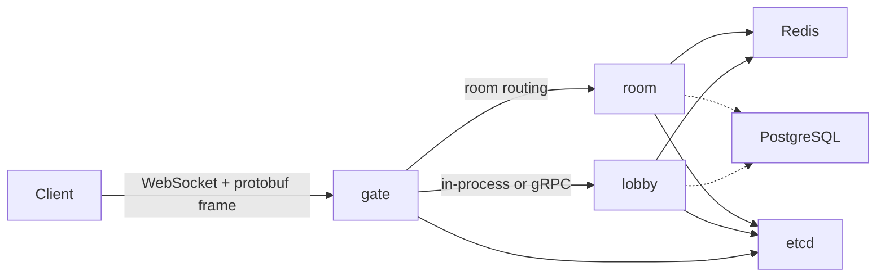

# 架构

## 阶段

- Phase 1：在 `cmd/all` 中的单进程 MVP。
- Phase 2：拆分 `gate`、`lobby` 与 `room`。
- Phase 3：引入 PostgreSQL 持久化与断线重连恢复。
- Phase 4：交互式房间主循环与多候选抢答（[ADR-0015](adr/0015-phase4-interactive-room-loop.md)）。
- Phase 5：血战规则补完、room 引擎拆分与可观测性最小集合（[ADR-0017](adr/0017-room-engine-and-settlement-boundary.md)、[ADR-0019](adr/0019-phase5-observability-metrics.md)）。
- Phase 5.3 / 5.4 / 5.5：规则深化、庄家与高阶番种、运行时参数与存储弹性（[ADR-0020](adr/0020-phase5-rules-deepening.md)、[ADR-0021](adr/0021-phase5-4-dealer-and-advanced-fans.md)、[ADR-0022](adr/0022-phase5-5-runtime-knobs-and-storage-resilience.md)）。
- Phase 6：生产部署、SLO、压测与容量基线（范围见 [ADR-0023](adr/0023-phase6-scope-and-roadmap.md)）。

## 运行时拓扑

## 边界

- `internal/mahjong`：仅包含确定性规则与计分。
- `internal/domain`：领域模型，不含传输层关切。
- `internal/service`：编排领域与基础设施。
- `internal/handler`：入站协议适配。
- `internal/net`：WebSocket 传输与帧编解码。
- `internal/cluster`：发现与远程路由。

## 并发模型

每个房间拥有**单一事件循环 Goroutine**。外部请求被转换为房间事件，从而避免共享可变牌桌状态。
