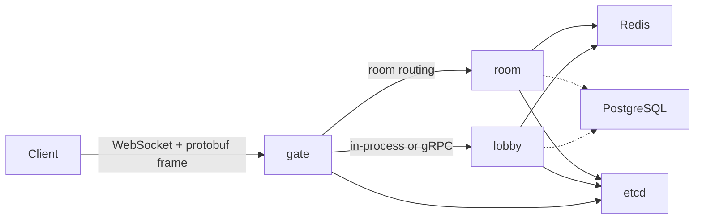

# 架构

## 阶段

- Phase 1：在 `cmd/all` 中的单进程 MVP。
- Phase 2：拆分 `gate`、`lobby` 与 `room`。
- Phase 3：引入 PostgreSQL 持久化与断线重连恢复。

## 运行时拓扑

## 边界

- `internal/mahjong`：仅包含确定性规则与计分。
- `internal/domain`：领域模型，不含传输层关切。
- `internal/service`：编排领域与基础设施。
- `internal/handler`：入站协议适配。
- `internal/net`：WebSocket 传输与帧编解码。
- `internal/cluster`：发现与远程路由。

## 并发模型

每个房间拥有**单一事件循环 Goroutine**。外部请求被转换为房间事件，从而避免共享可变牌桌状态。
