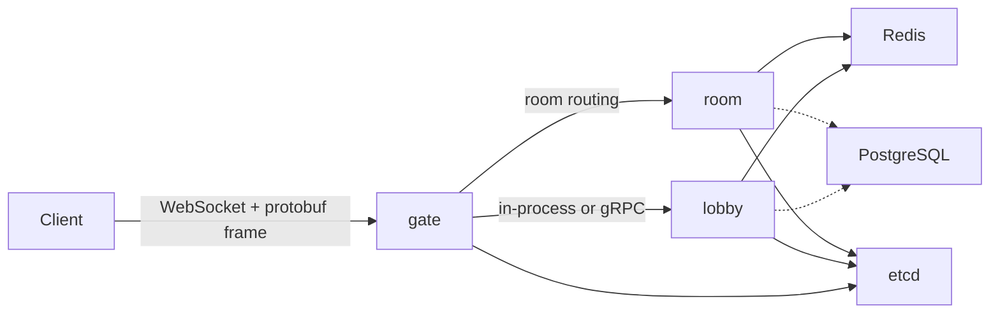

# 架构

## 阶段

- Phase 1：在 `cmd/all` 中的单进程 MVP。
- Phase 2：拆分 `gate`、`lobby` 与 `room`。
- Phase 3：引入 PostgreSQL 持久化与断线重连恢复。
- Phase 4：交互式房间主循环与多候选抢答（[ADR-0015](adr/0015-interactive-room-loop.md)）。
- Phase 5：血战规则补完、room 引擎拆分与可观测性最小集合（[ADR-0017](adr/0017-room-engine-and-settlement-boundary.md)、[ADR-0019](adr/0019-observability-metrics.md)）。
- Phase 5.3 / 5.4 / 5.5：规则深化、庄家与高阶番种、运行时参数与存储弹性（[ADR-0020](adr/0020-rules-deepening.md)、[ADR-0021](adr/0021-dealer-and-advanced-fans.md)、[ADR-0022](adr/0022-runtime-knobs-and-storage-resilience.md)）。
- Phase 6：生产部署、SLO、压测与容量基线（范围见 [ADR-0023](adr/0023-scope-and-roadmap.md)，部署与 SLO 见 [ADR-0024](adr/0024-deployment-and-slo.md)，压测容量见 [ADR-0025](adr/0025-load-and-capacity.md)，备份与凭据见 [ADR-0026](adr/0026-postgres-backup-and-restore.md)、[ADR-0027](adr/0027-secret-and-credential-management.md)）。
- Phase 7：玩家客户端、四川血战权威局内契约与状态投影契约（[ADR-0038](adr/0038-cli-symmetric-tui-layout.md)、[ADR-0039](adr/0039-sichuan-xuezhandaodi-authoritative-round-contract.md)、[ADR-0044](adr/0044-room-state-and-client-contract.md)）。

## 运行时拓扑

```mermaid
flowchart LR
    Client["Client"] -->|"WebSocket + protobuf frame"| Gate["gate"]
    Gate -->|"in-process or gRPC"| Lobby["lobby"]
    Gate -->|"room routing"| Room["room"]
    Lobby --> Redis["Redis"]
    Room --> Redis
    Gate --> Etcd["etcd"]
    Lobby --> Etcd
    Room --> Etcd
    Lobby -.-> PG["PostgreSQL"]
    Room -.-> PG
```

## 部署与可观测

Phase 6 生产交付工件集中在 `deploy/`：`docker/` 提供三服务镜像定义，`k8s/base/` 提供基础清单，`k8s/overlays/example/` 展示托管 Secret placeholder overlay，`observability/` 提供 Prometheus recording/alerting rules，`ops/postgres-restore.md` 记录 PostgreSQL 恢复演练 runbook。

## 客户端 TUI

`cmd/cli` 负责把 `client.v1` 事件转换为 `RoomView`，再渲染为黑白终端牌桌。牌桌布局采用 [ADR-0038](adr/0038-cli-symmetric-tui-layout.md) 的四方对称拓扑：北/南横排，西/东单行紧凑，中央桌面承载阶段化 HUD、操作提示与出牌史。`DerivePhase` 是中央桌面、键栏与帮助浮窗共享的阶段派生入口，优先读取服务端 `RoundPhase` 与 `acting_seats`；重连恢复以 `SnapshotNotify.last_step` 为权威切点，丢弃快照之前的陈旧推进事件。

## 局内权威契约

四川血战局内链路遵循 [ADR-0039](adr/0039-sichuan-xuezhandaodi-authoritative-round-contract.md)：玩家显式命令与托管命令在 room engine 中分流；换三张方向、定缺结果与阶段由 `RoundState` 统一下发；隐私敏感通知通过 `Notification.PrivacyPerSeat` 由网关按座位投影，避免其他玩家收到摸牌明文。

## 状态投影边界

[ADR-0044](adr/0044-room-state-and-client-contract.md) 将客户端可见状态拆为 `RoomLifecycle`、`RoundProgress`、`SeatRoster`、`RoundFacts` 与 `UXTransient`：

- `internal/domain/room.FSM` 是 `RoomLifecycle` 唯一来源，只描述等待、开局、对局、结算和关闭等房间生命周期。
- `internal/service/room` 是局内状态唯一投影来源。事件通知、重连快照、bot 视图和持久化恢复必须共用同一 projector 输出 `RoundProgress`、`SeatRoster` 与 `RoundFacts`。
- `internal/handler`、`cmd/gate`、本地 gateway 和远程 gateway 只做协议转换、定向投影和路由，不拼下一行动者、座位状态或 UI 阶段。
- `cmd/cli` 的 reducer 只折叠服务端事实；光标、pending、notice、中文文案和布局焦点属于 `UXTransient`，不得写回协议事实。
- `internal/app` 的 bot supervisor 消费与客户端同源的 `RoundProgress` 和 `SeatRoster`，不得从 UI 状态、日志或补状态分支推断座位是否可行动。

## 边界

- `internal/mahjong`：仅包含确定性规则与计分。
- `internal/domain`：领域模型，不含传输层关切。
- `internal/service`：编排领域与基础设施。
- `internal/handler`：入站协议适配。
- `internal/net`：WebSocket 传输与帧编解码。
- `internal/cluster`：发现与远程路由。

## 并发模型

每个房间拥有**单一事件循环 Goroutine**。外部请求被转换为房间事件，从而避免共享可变牌桌状态。
