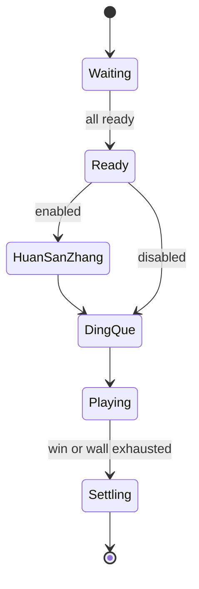

# 房间状态机

## 状态

```mermaid
stateDiagram-v2
    [*] --> Waiting
    Waiting --> Ready: all ready
    Ready --> HuanSanZhang: enabled
    HuanSanZhang --> DingQue
    Ready --> DingQue: disabled
    DingQue --> Playing
    Playing --> Settling: win or wall exhausted
    Settling --> [*]
```

## 事件来源

- 来自网关的玩家指令
- 内部定时器
- 重连或快照恢复

## 不变量

1. 仅房间循环可变更房间状态。
2. 动作须通过当前激活的规则实现校验。
3. 结算消费终局状态的冻结快照。
