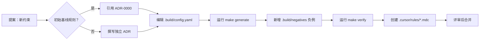

# 规则生命周期

规则用于引导人类编辑与 AI 辅助。**Constraint** 规则属于仓库契约的一部分，且必须始终可执行。

## 生命周期

## 必填字段

- `constraint`：`adr`、`enforcer`、`negative_test`
- `norm`：`adr`

## 验收

一条规则仅在以下条件满足时被接受：

1. 元数据符合 `.build/schema/rule.schema.json`。
2. enforcer 已接入 `make verify`。
3. 负例在隔离运行时按预期失败。

## 运行时 ADR

非治理约束但会改变协议、房间引擎、计时器、恢复或可观测性边界的变更，也应记录独立 ADR。Phase 5 示例包括 proto baseline 重置、room 引擎与结算边界、时钟/托管调度、可观测指标最小集合。
